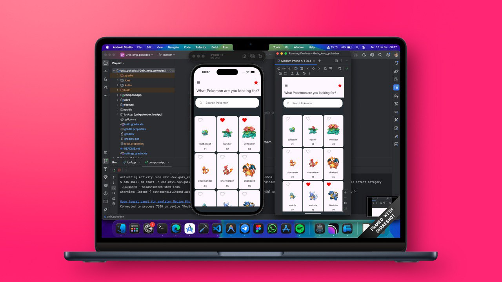

<div>


</div>

# GnixPokedex 📱

Aplicativo de Pokedex desenvolvido para estudo e aprendizado de **Kotlin Multiplatform (KMP)**, demonstrando a criação de aplicativos mobile multiplataforma para Android e iOS utilizando código compartilhado.

## 📋 Sobre o Projeto

Este projeto é uma aplicação educacional que implementa uma Pokedex completa, permitindo visualizar informações detalhadas sobre Pokémons, buscar por nome ou número, favoritar pokémons e explorar suas características. O principal objetivo é demonstrar as capacidades do **Kotlin Multiplatform** na criação de aplicações mobile modernas.

## 🎯 Objetivo

Aplicativo desenvolvido exclusivamente para **estudo do Kotlin Multiplatform**, explorando conceitos como:
- Arquitetura multiplataforma
- Compartilhamento de código entre Android e iOS
- Padrões de design aplicados em KMP
- Integração com APIs REST
- Persistência de dados local
- UI declarativa com Compose Multiplatform

## 🏗️ Arquitetura

O projeto segue os princípios da **Clean Architecture** com separação clara de responsabilidades em módulos:

### Estrutura de Módulos

```
gnixpokedex/
├── core/
│   ├── common/          # Utilitários e extensões compartilhadas
│   ├── model/           # Modelos de dados
│   ├── domain/          # Lógica de negócio e casos de uso
│   ├── data/            # Implementação de repositórios
│   ├── network/         # Configuração e serviços de rede
│   ├── database/        # Configuração e entidades do banco de dados
│   └── ui/              # Componentes de UI compartilhados
├── feature/
│   ├── home/            # Feature de listagem de Pokémons
│   ├── details/         # Feature de detalhes do Pokémon
│   └── favorite/        # Feature de favoritos
├── shared/              # Módulo principal de composição
└── androidApp/          # Aplicativo Android
```

### Design Patterns Implementados

1. **Clean Architecture**
    - Separação em camadas: Domain, Data, Presentation
    - Independência de frameworks e UI

2. **MVVM (Model-View-ViewModel)**
    - ViewModels para gerenciamento de estado
    - Separação entre lógica de apresentação e UI

3. **Repository Pattern**
    - Abstração da fonte de dados (API + Database)
    - Fonte única de verdade para os dados

4. **Use Cases (Interactors)**
    - Lógica de negócio isolada e reutilizável
    - Responsabilidades bem definidas

5. **Dependency Injection**
    - Injeção de dependências com Koin
    - Modularização e testabilidade

6. **Feature Modules**
    - Módulos independentes por funcionalidade
    - Facilita manutenção e escalabilidade

## 🛠️ Tecnologias e Bibliotecas

### Core Technologies

- **Kotlin Multiplatform (KMP)** - Compartilhamento de código entre plataformas
- **Jetpack Compose Multiplatform** - Framework de UI declarativa
- **Kotlin 2.2.0** - Linguagem de programação
- **Kotlin Coroutines** - Programação assíncrona
- **Kotlinx Serialization** - Serialização JSON

### Dependency Injection

- **Koin 4.1.0** - Framework de injeção de dependências
    - `koin-core` - Core multiplataforma
    - `koin-android` - Extensões Android
    - `koin-compose-viewmodel` - Integração com ViewModels no Compose

### Networking

- **Ktor 3.2.1** - Cliente HTTP multiplataforma
    - `ktor-client-core` - Cliente HTTP base
    - `ktor-client-okhttp` - Engine Android (OkHttp)
    - `ktor-client-darwin` - Engine iOS
    - `ktor-client-content-negotiation` - Negociação de conteúdo
    - `ktor-serialization-kotlinx-json` - Serialização JSON
    - `ktor-client-logging` - Logging de requisições

### Database

- **Room 2.7.2** - Biblioteca de persistência Android
    - SQLite como banco de dados local
    - SQLite Bundled 2.5.2 - SQLite multiplataforma
    - KSP (Kotlin Symbol Processing) para geração de código

### UI & Navigation

- **Compose Multiplatform 1.8.2**
    - UI declarativa e compartilhada
    - Material 3 Design System
    - Preview e tooling
- **Navigation Compose 2.9.0-beta03** - Navegação entre telas
- **Kamel 1.0.6** - Carregamento e cache de imagens
    - `kamel-image` - Core de imagens
    - `kamel-image-compose` - Integração com Compose

### Lifecycle & State

- **AndroidX Lifecycle 2.9.1**
    - `lifecycle-viewmodel` - ViewModels
    - `lifecycle-runtime-compose` - Runtime para Compose

### Code Quality

- **Ktlint 13.0.0** - Linter e formatação de código Kotlin

### iOS Interoperability

- **SKIE 0.10.4** - Melhora a interoperabilidade Kotlin-Swift

## 📱 Plataformas Suportadas

- ✅ **Android** (Min SDK 24, Target SDK 36)
- ✅ **iOS** (iOS Simulator ARM64, iOS x64, iOS ARM64)

## 🚀 Como Executar

### Pré-requisitos

- JDK 11 ou superior
- Android Studio Hedgehog ou superior
- Xcode (para iOS, apenas no macOS)
- CocoaPods (para iOS)

### Build e Executar no Android

**Via Terminal:**

```bash
# Windows
.\gradlew.bat :androidApp:assembleDebug

# macOS/Linux
./gradlew :androidApp:assembleDebug
```

**Via Android Studio:**
1. Abra o projeto no Android Studio
2. Selecione o módulo `androidApp` como run configuration
3. Execute o aplicativo

### Build e Executar no iOS

1. Abra o projeto no Xcode navegando até `/iosApp`
2. Selecione o dispositivo/simulador desejado
3. Execute o aplicativo (⌘ + R)

Ou via terminal (macOS):

```bash
cd iosApp
xcodebuild -workspace iosApp.xcworkspace -scheme iosApp -configuration Debug
```

## 📦 Estrutura de Dependências

```
androidApp
  └── shared
      ├── core:common
      ├── core:model
      ├── core:domain
      │   ├── core:model
      │   ├── core:common
      │   └── core:data
      ├── core:data
      │   ├── core:model
      │   ├── core:common
      │   ├── core:network
      │   └── core:database
      ├── core:network
      │   ├── core:common
      │   └── core:model
      ├── core:database
      │   ├── core:model
      │   └── core:common
      ├── core:ui
      │   └── core:model
      ├── feature:home
      ├── feature:details
      └── feature:favorite
```

## 🎨 UI com Jetpack Compose

O projeto utiliza **Jetpack Compose Multiplatform** para criar uma interface de usuário moderna e declarativa:

### Características

- **Declarativa**: UI descrita como funções Kotlin
- **Reativa**: Atualização automática baseada em estado
- **Compartilhada**: Mesmo código de UI para Android e iOS
- **Material 3**: Design system moderno e acessível

### Componentes Principais

- Componentes reutilizáveis em `core:ui`
- Telas por feature (home, details, favorite)
- Navegação com Navigation Compose
- Carregamento de imagens com Kamel

## 🔄 Fluxo de Dados

```
UI (Compose)
    ↓
ViewModel (MVVM)
    ↓
UseCase (Domain Layer)
    ↓
Repository (Data Layer)
    ↓
DataSource (Network / Database)
```

## 📝 Observações de Desenvolvimento

- Este é um projeto educacional para aprendizado de Kotlin Multiplatform
- Foco em demonstrar padrões arquiteturais e boas práticas
- Estrutura modular facilita a expansão e manutenção

## 📚 Recursos de Aprendizado

- [Kotlin Multiplatform Documentation](https://kotlinlang.org/docs/multiplatform.html)
- [Compose Multiplatform](https://www.jetbrains.com/lp/compose-multiplatform/)
- [Koin Documentation](https://insert-koin.io/)
- [Ktor Documentation](https://ktor.io/)

## 📄 Licença

Este projeto é para fins educacionais.

---

Desenvolvido com ❤️ para estudos de Kotlin Multiplatform